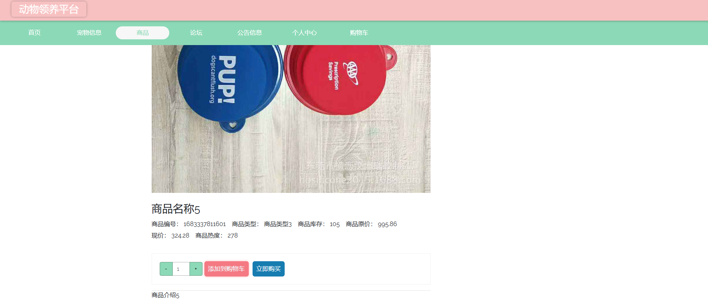
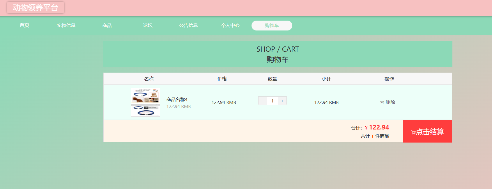

# 一、系统说明

基于springboot+vue+elementui开发的动物领养平台,系统功能齐全, 代码简洁易懂，适合小白学编程。

# 二、系统架构

######      前端：vue| elementui

######      后端：springboot | mybatis 

######      环境：jdk1.8+ | mysql8.0+ | maven

# 三、代码及数据库

# 四、相关功能介绍

#### 1).客户端

###### 1.登录

###### 2.注册

###### 3.首页

###### 4.宠物信息

###### 5.商品详情

###### 6.商品购买

###### 7.论坛

###### 8.公告信息

###### 9.个人中心

###### 10.个人中心->收货地址

包括:新增、删除功能

###### 11.个人中心->宠物收藏

包含:取消收藏、领养宠物 功能

###### 12.个人中心->宠物留言

###### 13.个人中心->宠物领养

###### 14.个人中心->商品收藏

###### 15.个人中心->商品评价

###### 16.个人中心->商品订单

###### 17.购物车

包含:结算、删除商品

#### 2).管理端

###### 1.登录

######2 .用户注册

###### 3.个人中心->修改密码

###### 4.管理员信息

包含:详情、删除、修改、查看、新增功能

###### 5.员工管理

包含:详情、修改、新增、重置密码功能

###### 6.用户管理

包含:详情、修改、新增、重置密码功能

###### 7.宠物信息管理

包含:新增、修改、删除、详情功能

###### 8.宠物信息管理->宠物留言

包含:详情、删除、查询功能

###### 9.宠物信息管理->宠物收藏

###### 10.宠物领养管理

包含:详情、删除、领养审核功能

###### 11.商品管理

包含:详情、修改、删除、新增、下架功能

###### 12.商品管理->商品评价

包含:详情、回复、删除功能

###### 13.商品管理->商品收藏

包含:详情、删除功能

###### 13.商品管理->商品订单

包含:详情、删除功能

###### 14.论坛管理

包含:详情、查看回帖、删帖、修改、新增功能

###### 15.公告信息

包含:详情、新增、修改、删除

###### 16.轮播图管理

###### 17.员工登录

员工功能与管理员一致，部分功能没有

